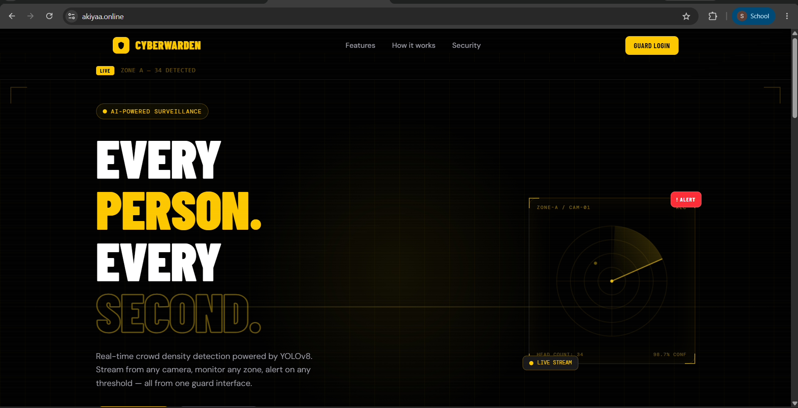
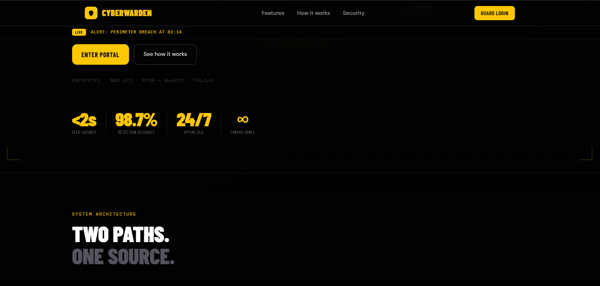
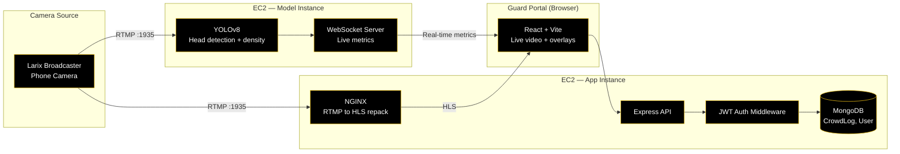
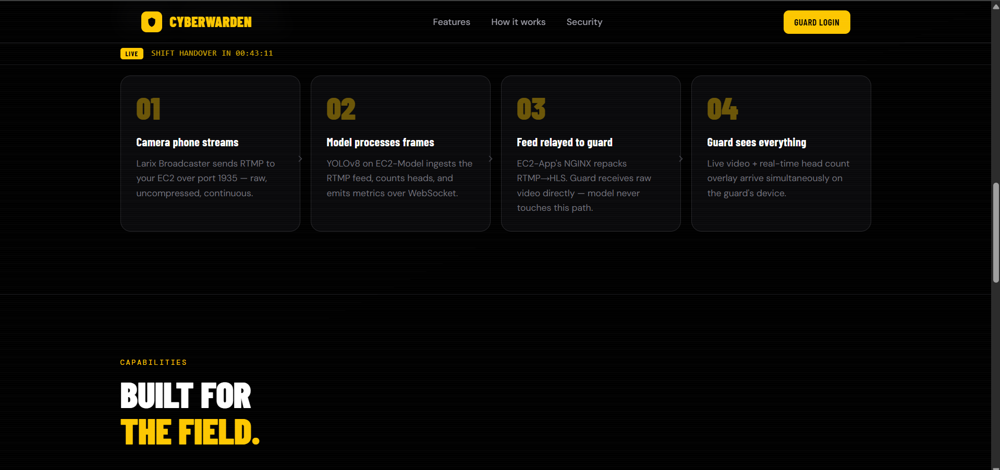
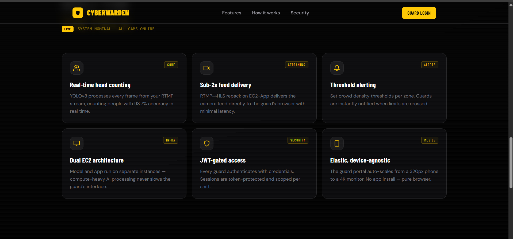
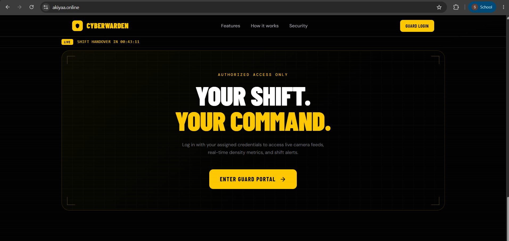

# CYBERWARDEN — AI-Powered Crowd Surveillance

Real-time crowd density detection and monitoring system for security guards, powered by YOLOv8. Streams from any phone camera, processes live video for head-count and density metrics, and alerts guards the moment a configured threshold is crossed — all through a single browser-based guard portal.

**Live:** [akiyaa.online](https://akiyaa.online)


*Every person, every second — live head-count overlay on the guard's camera feed.*

## Table of contents

- [Overview](#overview)
- [System architecture](#system-architecture)
- [How it works](#how-it-works)
- [Key features](#key-features)
- [Project structure](#project-structure)
- [Tech stack](#tech-stack)
- [Guard portal](#guard-portal)
- [Design notes](#design-notes)
- [Running locally](#running-locally)
- [Roadmap](#roadmap)

## Overview

CyberWarden turns any phone into a surveillance camera. A guard (or fixed camera rig) streams live RTMP video to the backend, where a YOLOv8 model counts people in real time, computes crowd density, and generates a live heatmap. If crowd density in a zone exceeds a configured threshold, the system fires an instant alert to the guard's dashboard — no dedicated hardware or app install required, just a browser.



## System architecture

The system is split across two dedicated AWS EC2 instances so that heavy AI inference never competes with — or slows down — the guard-facing video feed:



**Why two instances:** the raw video path (RTMP to HLS to guard's browser) never touches the model. Compute-heavy AI inference runs entirely on its own instance, so a spike in processing load never introduces lag or drops in the live feed the guard is watching.

## How it works



1. **Camera phone streams** — Larix Broadcaster sends RTMP to the EC2-Model instance over port 1935: raw, uncompressed, continuous.
2. **Model processes frames** — YOLOv8 on EC2-Model ingests the RTMP feed, counts heads per frame, computes density, and emits live metrics over WebSocket.
3. **Feed relayed to guard** — EC2-App's NGINX independently repacks the same RTMP stream to HLS. The guard receives raw video directly through this path — the model never touches it, so video delivery stays fast regardless of inference load.
4. **Guard sees everything** — Live video and the real-time head-count/density overlay arrive on the guard's device simultaneously, from two independent paths that converge only in the browser UI.

## Key features



| Feature | Description |
|---|---|
| **Real-time head counting** | YOLOv8 processes every frame from the RTMP stream, counting people with ~98.7% detection accuracy. |
| **Density heatmaps** | Per-zone crowd density is computed from head-count data and visualized as a live heatmap alongside the video feed. |
| **Threshold alerting** | Guards configure a crowd-density threshold per zone; the system fires an instant alert the moment it's crossed. |
| **Sub-2s feed delivery** | RTMP to HLS repacking on the App instance delivers the camera feed to the guard's browser with minimal latency. |
| **Dual EC2 architecture** | Model inference and app/video delivery run on separate EC2 instances, so AI processing load never affects feed latency. |
| **JWT-gated access** | Every guard authenticates with credentials; sessions are token-protected and scoped per shift. |
| **Elastic, device-agnostic** | The guard portal auto-scales from a 320px phone to a 4K monitor — no app install, pure browser. |

## Project structure

```
CYBERWARDEN/
├── client/                        # React + Vite frontend (guard portal)
│   ├── public/
│   │   ├── favicon.svg
│   │   └── icons.svg
│   ├── src/                       # UI components, pages, live feed viewer
│   ├── .gitignore
│   ├── eslint.config.js
│   ├── index.html
│   ├── package.json
│   └── vite.config.js
└── server/                        # Express backend (App EC2 instance)
    ├── config/
    │   └── db.js                  # MongoDB connection setup
    ├── middleware/
    │   └── authMiddleware.js      # JWT verification
    ├── models/
    │   ├── CrowdLog.js            # Density/head-count event records
    │   └── User.js                # Guard accounts
    ├── routes/                    # API endpoints (auth, feeds, alerts, logs)
    ├── node_modules/
    ├── .env
    ├── package.json
    └── server.js                  # Express app entrypoint
```

> The YOLOv8 model service (running on the separate Model EC2 instance) and the NGINX RTMP-to-HLS relay configuration are deployed independently of this repo's `client`/`server` split — see [System architecture](#system-architecture).

## Tech stack

- **Frontend:** React + Vite
- **Backend:** Node.js + Express
- **Database:** MongoDB (via Mongoose — `CrowdLog`, `User` models)
- **Auth:** JWT, verified via custom middleware
- **Crowd detection model:** YOLOv8 (head detection + density estimation)
- **Streaming:** RTMP ingest (Larix Broadcaster) to NGINX RTMP-to-HLS repack
- **Real-time metrics:** WebSocket (model to guard portal)
- **Infrastructure:** AWS EC2 (dual-instance: Model + App), deployed at [akiyaa.online](https://akiyaa.online)

## Guard portal

Guards log in with assigned credentials to access live camera feeds, real-time density metrics, and shift alerts.



Once authenticated, the portal shows:
- Live HLS video feed per camera zone
- Real-time head-count overlay
- Density heatmap
- Threshold-based alerts (e.g. perimeter breach, crowd density exceeded)
- Shift handover countdown

## Design notes

- **Video and inference are fully decoupled.** The guard's video feed is served by NGINX directly from the raw RTMP stream — it never passes through the YOLOv8 model. This means detection load (e.g. a dense crowd requiring more inference time) cannot introduce video lag.
- **Metrics arrive over a separate channel.** Head-count and density data are pushed to the guard portal via WebSocket, independently of the video path, and the UI overlays them on the live feed client-side.
- **Auth is stateless and scoped.** JWT tokens are issued per login and validated on every protected route via `authMiddleware.js`; sessions are intended to be scoped per shift.
- **Elastic by design.** The portal is a responsive web app with no native app requirement, intended to scale from a guard's phone to a control-room monitor.

## Running locally

**Frontend:**
```bash
cd client
npm install
npm run dev
```

**Backend:**
```bash
cd server
npm install
# Configure .env with MongoDB URI, JWT secret, and model/WebSocket endpoint
npm start
```

> Note: local development will not include the live YOLOv8 detection pipeline unless the Model EC2 instance (or a local equivalent) is also running and reachable by the backend/WebSocket configuration.

## Roadmap

- [ ] Multi-camera zone management UI
- [ ] Historical crowd-density analytics/reporting from `CrowdLog`
- [ ] Configurable alert channels (SMS/email in addition to in-portal alerts)
- [ ] Auto-scaling for the Model EC2 instance under high camera-zone count
- [ ] Document required `.env` variables for both `client` and `server`
